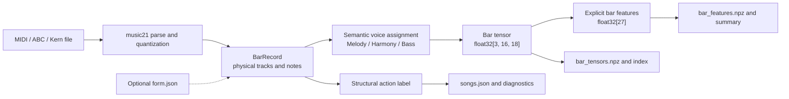
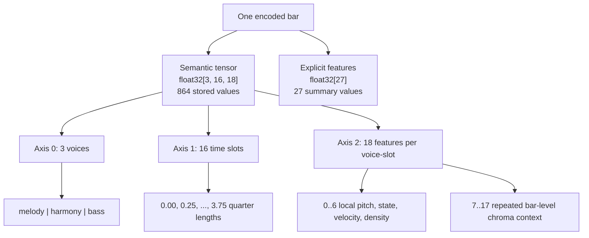
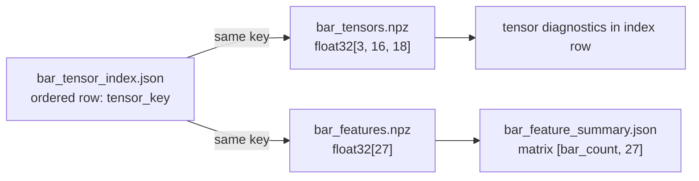

# Encoding Path Design

## Purpose

The encoding path converts symbolic music files into bar-aligned records, structural action labels, semantic tensors, explicit bar features, and diagnostics. These artifacts are the input contract for later model-training iterations.

This iteration supports one tensor backend: `semantic_3voice`. The backend always emits three semantic voices over sixteen time slots, regardless of the number or ordering of physical tracks in the source file.

## End-to-End Data Flow



## Encoding Shape At A Glance

One source bar produces two numeric objects. The tensor preserves time and semantic voice structure; the 27D vector summarizes the same bar for diagnostics and downstream tabular use.



The tensor can be pictured as a `3 x 16` grid. Every cell contains one 18D feature vector:

```text
                         axis 1: time slot ->
axis 0: voice       00      01      02      ...     15
melody (0)        [18D]   [18D]   [18D]    ...   [18D]
harmony (1)       [18D]   [18D]   [18D]    ...   [18D]
bass (2)          [18D]   [18D]   [18D]    ...   [18D]

one 18D cell
|<----------- local voice-slot state ----------->|<---- bar context ---->|
[pitch, rest, onset, hold, velocity, ratio, density, chroma_00, ..., chroma_10]
  0      1      2      3       4        5       6          7      ...      17
```

Features 0 through 6 can change for every voice and slot. Features 7 through 17 repeat the same bar-level chroma embedding in all 48 cells, so downstream models can access harmonic context even at a rest position.

## Input Data

### Symbolic Music Files

- Supported suffixes: `.mid`, `.midi`, `.abc`, and `.krn`.
- Discovery: recursive under the selected dataset directory.
- Time unit: music21 quarter length.
- Pitch unit: integer MIDI pitch, normally `0..127`.
- Velocity unit: integer MIDI velocity, normally `0..127`; missing velocity defaults to `64`.

### Optional Form Metadata

`form.json` is a JSON object keyed by exact source file name. The parser copies `form`, section name, and section index into song and bar records. Encoding does not infer or modify the form metadata.

### Runtime Configuration

`config/style_defaults.yaml` contains only sections read by this migration:

- `music_parser`: quantization, bar length, track limit, register splits, and default velocity.
- `bar_tensor`: semantic backend, tensor dimensions, normalization scales, and voice policy.
- `action_labeler`: thresholds used to assign structural action labels.

## Stage 1: Parse And Quantize Music

### Score Quantization

When enabled, both event offsets and durations are quantized with music21 divisors `[4, 3]`. This supports ordinary binary subdivisions and triplets while removing small expressive MIDI timing drift.

### Physical Track Selection

For a score with multiple parts, parts are ranked by note-event count and the three most active parts are retained. For a single stream, events are split by register:

| Physical register | MIDI pitch rule |
| --- | --- |
| High | `pitch > 72` |
| Middle | `55 < pitch <= 72` |
| Low | `pitch <= 55` |

These physical tracks preserve parsed source organization. They do not define the final tensor axis; semantic voices are reassigned independently for every time slot.

### Bar Construction

- Configured bar length: `4.0` quarter lengths.
- Bar count: `ceil(max_note_end / 4.0)`, with at least one bar.
- Each note overlapping a bar is clipped to the bar interval.
- Stored onset and duration become bar-local quarter lengths in `[0, 4.0]`.
- Each `BarRecord` retains source song, source bar count, physical tracks, optional form, and optional section metadata.

Parser failures are recorded per file. One invalid file does not stop other files in the directory.

## Stage 2: Assign Structural Actions

Action labels are metadata stored with each bar; they are not channels in the 18D tensor.

Each bar first receives a normalized 28D comparison vector:

- 12 duration-weighted absolute pitch-class bins.
- 16 onset-count bins over the bar grid.

Rules run in this order:

1. `REPEAT`: cosine similarity to the previous bar is at least `0.95`.
2. `RETURN`: a later run of at least two bars has similarity at least `0.85` to the mean of the first four bars.
3. `DEVELOP`: note density and pitch variance exceed `1.3` times their song medians.
4. `CADENCE`: a bar is in the final two bars of an eight-bar phrase, ends on configured pitch class `0` or `7`, and has low density and pitch variance.
5. Remaining opening bars become `INTRODUCE`; other unmatched bars become `VARY`.

Diagnostics retain the final action, reason, scalar features, and per-song action counts.

## Stage 3: Build The Semantic Bar Tensor

### Tensor Axes

Each bar becomes one NumPy `float32[3, 16, 18]` array:

| Axis | Size | Meaning |
| --- | ---: | --- |
| 0 | 3 | Semantic voice: `0=melody`, `1=harmony`, `2=bass` |
| 1 | 16 | Time slot within the bar |
| 2 | 18 | Feature vector for one voice and slot |

For a four-quarter-length bar, each slot spans `4.0 / 16 = 0.25` quarter lengths.

### Active And Onset Notes

For slot interval `[slot_start, slot_end)`:

- A note is active when `onset < slot_end` and `onset + duration > slot_start`.
- A note is an onset when `slot_start <= onset < slot_end`.

### Semantic Voice Assignment

Voice assignment is recomputed in each slot:

- Melody: highest active pitch, except the previously selected melody is retained when it remains active and is no more than seven semitones below the current highest pitch.
- Bass: lowest active pitch after excluding the selected melody.
- Harmony: all remaining active notes. Harmony may therefore be polyphonic.

The assignment gives fixed musical meaning to tensor axis 0 even when the source has one track, many tracks, or changing part order.

### Bar-Relative Reference Data

#### `base_pitch`

`base_pitch` is the lowest MIDI pitch across all notes in the bar. It is the shared anchor for relative-pitch features and chromagram rotation. Empty input produces `None` because no physical pitch is available.

#### `relative_chromagram`

`relative_chromagram` is a NumPy `float32[12]` vector. Its input notes provide integer MIDI `pitch`, quarter-length `duration_ql`, and MIDI `velocity`. The current configuration sets `velocity_scale=127`, but the algorithm uses the configured scale rather than a fixed constant.

The calculation is:

1. Compute `base_pc = base_pitch % 12`, which rotates the anchor pitch class to relative bin 0.
2. Map each note to `relative_bin = (pitch - base_pc) % 12`.
3. Add `max(0, duration_ql) * clamp(velocity, 0, velocity_scale) / velocity_scale` to that bin. The implementation guards a non-positive velocity scale with a minimum divisor of `1e-8`.
4. Divide all bins by their total when the accumulated weight is positive. Empty input or a zero total returns an all-zero `float32[12]` vector.

For example, consider two one-quarter-length notes with `velocity_scale=127`:

```text
C3: pitch=48, duration_ql=1.0, velocity=127
G3: pitch=55, duration_ql=1.0, velocity=64
```

The anchor is C3 (`base_pitch=48`, `base_pc=0`). C3 contributes `1.0` to relative bin 0, while G3 contributes `64/127 = 0.503937` to relative bin 7. After dividing by the total `1.503937`, the normalized chromagram contains approximately `bin_0=0.664921` and `bin_7=0.335079`; all other bins are zero. Both occupied bins are below 10, so the 11D projection copies these two values unchanged.

#### `relative_chroma_embedding`

`relative_chroma_embedding` is the NumPy `float32[11]` result of passing `relative_chromagram` to `FixedChromagramProjector`. Output bins `0..9` copy chromagram bins `0..9`, and output bin 10 stores `(chromagram_bin_10 + chromagram_bin_11) / 2`. The projector does not apply a second normalization.

The same bar-level `relative_chroma_embedding` is written to tensor features `relative_chroma_embed_00..10` for every voice and slot, including rest slots. This supplies harmonic context where no local voice is active.

### The 18 Slot Features

| Index | Name | Processing |
| ---: | --- | --- |
| 0 | `relative_pitch` | `(representative_pitch - base_pitch) / 24`; harmony uses the mean pitch of its active notes |
| 1 | `is_rest` | `1.0` when the semantic voice is inactive, otherwise `0.0` |
| 2 | `is_note_on` | `1.0` when at least one assigned note starts in this slot |
| 3 | `is_hold` | `1.0` when the voice is active but has no onset in this slot |
| 4 | `normalized_velocity` | representative velocity divided by `127`; harmony uses maximum velocity by configuration |
| 5 | `velocity_ratio` | voice velocity divided by the sum of the three semantic voice velocities in the slot |
| 6 | `density_gradient` | voice active-slot density minus the mean density of the other two voices |
| 7..17 | `relative_chroma_embed_00..10` | repeated 11D bar-relative chroma embedding |

For a rest slot, indices `0, 2, 3, 4, 5` are zero and index 1 is one. Density gradient and chroma context remain populated.

## Stage 4: Extract The 27D Bar Feature Vector

The explicit feature extractor reads the completed `[3, 16, 18]` tensor. Note-on, hold, and rest masks come from tensor features 2, 3, and 1 respectively.

| Indices | Feature group | Processing |
| --- | --- | --- |
| 0..3 | Global state density | Note-on, active, rest, and hold counts divided by all `3 * 16 = 48` voice slots |
| 4..11 | Pitch summary | Mean, standard deviation, minimum, maximum, range, first, last, and last-minus-first relative onset pitch |
| 12..13 | Velocity summary | Mean and standard deviation of normalized velocity at note-on positions |
| 14..17 | Rhythm summary | Normalized onset centroid, onset spread, normalized entropy, and fraction of time slots containing an onset |
| 18..20 | Per-voice note density | Note-on count divided by 16 for melody, harmony, and bass |
| 21..23 | Per-voice active density | Note-on-or-hold count divided by 16 for melody, harmony, and bass |
| 24..26 | Interval summary | Mean, maximum, and standard deviation of absolute differences between onset pitches ordered by time slot then voice |

Pitch and interval features use normalized relative pitch from tensor feature 0, not absolute MIDI pitch. A bar without note onsets receives zero for pitch, velocity, rhythm, and interval summaries.

The 27D vector is a concatenation of six fixed groups:

```text
float32[27]

 0          4             12    14          18                  24       27
 | state 4D | pitch 8D    |vel 2D| rhythm 4D | voice density 6D | intvl 3D |
 |----------|-------------|------|-----------|------------------|----------|
```

It is a summary rather than a reversible encoding. The `[3, 16, 18]` tensor retains slot-level structure; the `[27]` vector does not contain enough information to reconstruct the original notes.

## Simple Numerical Example

Assume a MIDI bar contains one C4 note:

```text
pitch = 60
onset = 0.0 quarter lengths
duration = 1.0 quarter length
velocity = 64
```

After quantization and bar clipping:

- The note occupies slots `0..3` because each slot is `0.25` quarter lengths.
- `base_pitch = 60`.
- The note becomes melody; harmony and bass remain inactive.
- Melody density is `4/16 = 0.25`; harmony and bass density are zero.
- Melody density gradient is `0.25 - mean(0, 0) = 0.25`.
- Harmony and bass gradients are `0 - mean(0.25, 0) = -0.125`.
- Relative chromagram bin 0 is 1, so the 11D embedding begins `[1, 0, ...]`.

The first melody slot begins approximately as follows:

```text
# [relative_pitch, rest, onset, hold, velocity, velocity_ratio,
#  density_gradient, chroma_00, chroma_01, ... chroma_10]
[0.0, 0.0, 1.0, 0.0, 0.5039, 1.0, 0.25, 1.0, 0.0, ..., 0.0]
```

Melody slots 1 through 3 use `is_hold=1`. Melody slots 4 through 15 use `is_rest=1`, while retaining density gradient `0.25` and the bar chroma embedding. The final output still has shape `[3, 16, 18]` even though the source contains only one note and one physical track.

The state channels of the complete `3 x 16` grid therefore look like this:

```text
Legend: O = is_note_on, H = is_hold, R = is_rest

slot       00 01 02 03 04 05 06 07 08 09 10 11 12 13 14 15
melody      O  H  H  H  R  R  R  R  R  R  R  R  R  R  R  R
harmony     R  R  R  R  R  R  R  R  R  R  R  R  R  R  R  R
bass        R  R  R  R  R  R  R  R  R  R  R  R  R  R  R  R
```

The grid only visualizes features 1 through 3. Every cell also contains relative pitch, velocity, velocity ratio, density gradient, and the repeated 11D chroma context.

Selected 27D feature values for this bar are:

```text
note_density        = 1 / 48
active_density      = 4 / 48
rest_density        = 44 / 48
hold_density        = 3 / 48
track0_note_density = 1 / 16
track0_active_density = 4 / 16
track1 and track2 densities = 0
```

## Output Artifacts

Each encoded bar uses a stable key:

```text
<song_id>__bar_<zero-padded-bar-index>
example__bar_0000
```

The key is the join contract across the three bar-level files:



| Artifact | Data contract |
| --- | --- |
| `songs.json` | Ordered songs, bars, physical tracks, notes, form metadata, actions, and action reasons |
| `bar_tensors.npz` | One `float32[3, 16, 18]` array per tensor key |
| `bar_features.npz` | One `float32[27]` array per matching tensor key |
| `bar_tensor_index.json` | Ordered rows mapping tensor key to song, bar index, shape, and tensor diagnostics |
| `bar_feature_summary.json` | Feature names, matrix shape `[bar_count, 27]`, means, and standard deviations |
| `encoding_diagnostics.json` | Parser failures, action counts, tensor shapes/densities, and feature summary |

`bar_tensor_index.json` defines row order. Tensor and feature archives must contain exactly the same key set as the index.
